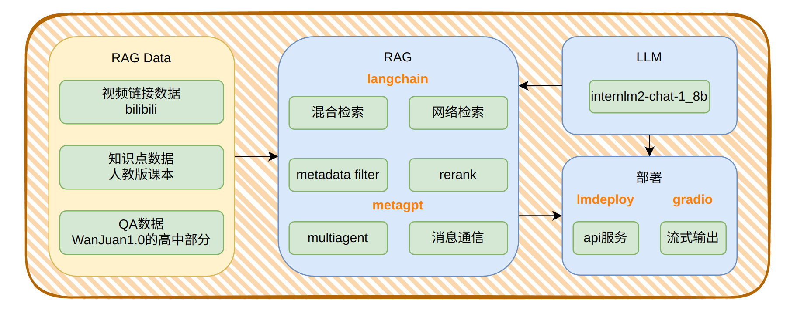
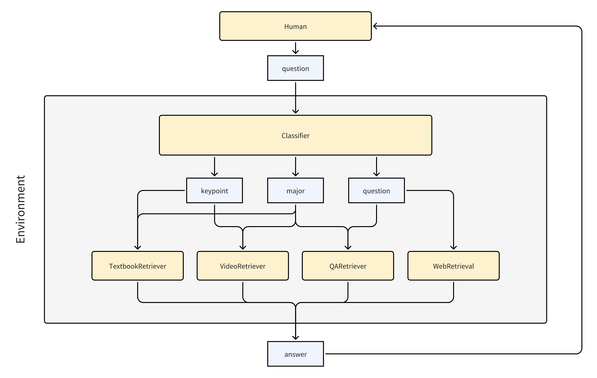

<div align="center">
  <a href="https://github.com/time1527/TeaChat">
    
  </a>
</div>

# TeaChat
<a href="https://img.shields.io/badge/language-python-blue"></a>
<a href="https://github.com/time1527/TeaChat/stargazers"></a>
<a href="https://github.com/time1527/TeaChat/network/members"></a>
<a href="https://github.com/time1527/TeaChat/pulls"></a>
<a href="https://github.com/time1527/TeaChat/issues"></a>
<a href="https://github.com/time1527/TeaChat/blob/master/LICENSE"></a>

<!--
<a href="https://github.com/time1527/TeaChat/graphs/contributors"></a>
-->

TeaChat教育智能系统深度整合高中教学资源矩阵（权威教材、知识点视频讲解库、题目数据库），基于Multi-Agent RAG技术，实现九大学科（数/语/英/物/化/生/政/史/地）的智能教学服务。系统通过智能体协同机制完成知识定位-知识讲解-题目巩固的完整教学链路，以技术创新推动教育普惠，致力于打造零门槛、全免费的个性化AI助学平台，助力教育公平化进程。

## Framework



## QuickStart

创建虚拟环境：

```bash
conda create -n teachat python=3.10
conda activate teachat
```

获取项目：

```bash
git clone https://github.com/time1527/TeaChat.git
cd TeaChat
```

安装依赖：

```bash
pip install -r requirements.txt
```

修改settings.py内的本地路径

如果使用QA检索，需要下载[WanJuan1.0](https://opendatalab.com/OpenDataLab/WanJuan1_dot_0)，再：

```bash
python rag_data/qa/wanjuanqa.py  [your local path eg./home/pika/Dataset/sft/wanjuan/part-003756-a894b46e.jsonl]
```

运行：

```bash
bash run.sh
```

RAG效果展示：

[web RAG](./assets/web.mkv)；[textbook RAG & QA、video检索](./assets/qa.mkv)

## Catalogue

```bash
├── assets：图片
├── backup：微调相关备份
├── gradio_app_with_multiagent.py：前端
├── LICENSE
├── multi_agent：metagpt
├── rag：检索
├── rag_data：RAG数据整理
├── README.md
├── requirements.txt
├── run.sh：lmdeploy serve + gradio_app
└── test：测试
```

* [multi_agent](./multi_agent/README.md)：使用MetaGPT实现多智能体，包括根据用户消息提取知识点/学科/问题、检索课本知识点/视频讲解/题目/网络。

  

* [rag_data](./rag_data)：

  * 视频链接数据：爬取bilibili视频url。
  * 知识点数据：GPT识别人教版课本目录，人工简单检查，根据页码提取pdf内容。
  * QA数据：[WanJuan1.0](https://opendatalab.com/OpenDataLab/WanJuan1_dot_0)中的高中数据。

* [rag](./rag)：

  * 元数据筛选：改写Langchain的`BM25Retriever`，为其添加元数据筛选功能。
  * web检索：改写Langchain的`WebResearchRetriever`，使用`GoogleSerperAPIWrapper`，并省去需要LLM的步骤。
  * 混合检索：`BM25FilterRetriever` + `FAISS.as_retriever()`
  * 重排序

## Timeline

2024-04-20：RAG数据收集、整理

2024-04-26：RAG

2024-05：Multi-Agent RAG

## Data Used 

1. 数据集[WanJuan1.0](https://opendatalab.com/OpenDataLab/WanJuan1_dot_0)：许可协议为 [CC BY-NC 4.0](https://creativecommons.org/licenses/by/4.0/)

## Reference

1. [InternLM/Tutorial](https://github.com/InternLM/Tutorial)：https://github.com/InternLM/Tutorial

2. [langchain](https://github.com/langchain-ai/langchain)：https://github.com/langchain-ai/langchain

5. ```
   @misc{2023lmdeploy,
       title={LMDeploy: A Toolkit for Compressing, Deploying, and Serving LLM},
       author={LMDeploy Contributors},
       howpublished = {\url{https://github.com/InternLM/lmdeploy}},
       year={2023}
   }
   ```

9. ```
   @misc{he2023wanjuan,
         title={WanJuan: A Comprehensive Multimodal Dataset for Advancing English and Chinese Large Models}, 
         author={Conghui He and Zhenjiang Jin and Chao Xu and Jiantao Qiu and Bin Wang and Wei Li and Hang Yan and Jiaqi Wang and Dahua Lin},
         year={2023},
         eprint={2308.10755},
         archivePrefix={arXiv},
         primaryClass={cs.CL}
   }
   ```

11. ```
    @misc{hong2023metagpt,
          title={MetaGPT: Meta Programming for A Multi-Agent Collaborative Framework}, 
          author={Sirui Hong and Mingchen Zhuge and Jonathan Chen and Xiawu Zheng and Yuheng Cheng and Ceyao Zhang and Jinlin Wang and Zili Wang and Steven Ka Shing Yau and Zijuan Lin and Liyang Zhou and Chenyu Ran and Lingfeng Xiao and Chenglin Wu and Jürgen Schmidhuber},
          year={2023},
          eprint={2308.00352},
          archivePrefix={arXiv},
          primaryClass={cs.AI}
    }
    ```

12. ```
    @misc{hong2024data,
          title={Data Interpreter: An LLM Agent For Data Science}, 
          author={Sirui Hong and Yizhang Lin and Bang Liu and Bangbang Liu and Binhao Wu and Danyang Li and Jiaqi Chen and Jiayi Zhang and Jinlin Wang and Li Zhang and Lingyao Zhang and Min Yang and Mingchen Zhuge and Taicheng Guo and Tuo Zhou and Wei Tao and Wenyi Wang and Xiangru Tang and Xiangtao Lu and Xiawu Zheng and Xinbing Liang and Yaying Fei and Yuheng Cheng and Zongze Xu and Chenglin Wu},
          year={2024},
          eprint={2402.18679},
          archivePrefix={arXiv},
          primaryClass={cs.AI}
    }
    ```

## Acknowledgement

感谢[书生浦语第二期训练营](https://github.com/InternLM/Tutorial/tree/camp2)
