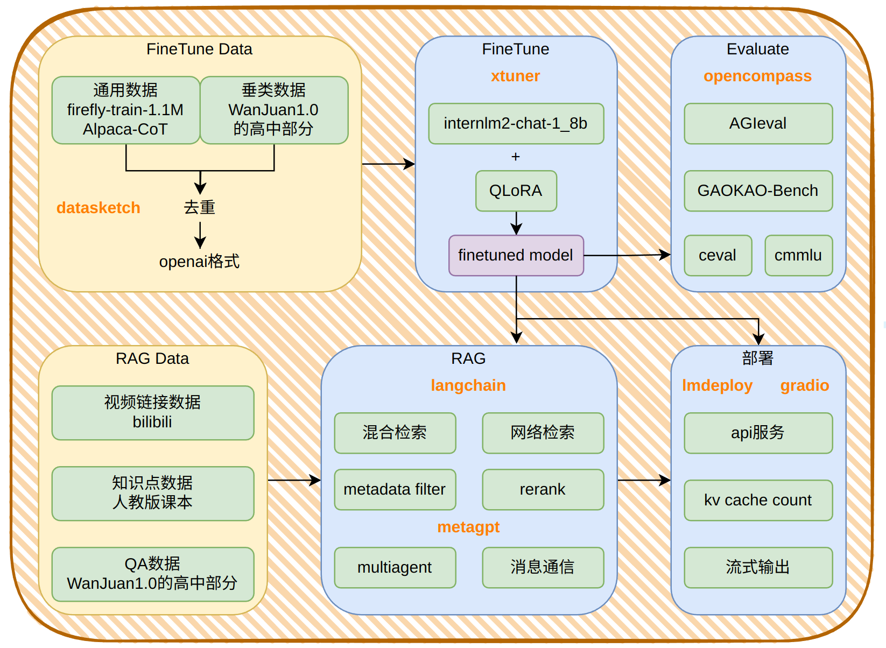

<div align="center">
  <a href="https://github.com/time1527/TeaChat">
    
  </a>
</div>

# TeaChat
<a href="https://img.shields.io/badge/language-python-blue"></a>
<a href="https://github.com/time1527/TeaChat/stargazers"></a>
<a href="https://github.com/time1527/TeaChat/network/members"></a>
<a href="https://github.com/time1527/TeaChat/pulls"></a>
<a href="https://github.com/time1527/TeaChat/issues"></a>
<a href="https://github.com/time1527/TeaChat/blob/master/LICENSE"></a>

<!--
<a href="https://github.com/time1527/TeaChat/graphs/contributors"></a>
-->

TeaChat使用题库作为垂类语料库，涵盖数学、语文、英语、物理、化学、生物、政治、历史、地理九大高中学科，使用fine-tune、RAG、Multi-Agent技术，提供高考习题解答、解析功能，旨在响应深化教育改革、促进教育公平的发展理念，提供一款人人可用的免费教师AI，减小教育资源差距。

## Framework



## QuickStart

创建虚拟环境：

```bash
conda create -n teachat python=3.10
conda activate teachat
```

获取项目：

```bash
git clone https://github.com/time1527/TeaChat.git
cd TeaChat
```

安装依赖：

```bash
pip install -r requirements.txt
```

运行：

```bash
bash run.sh
```

## Catalogue

```bash
├── assets：图片
├── data：增量预训练、sft数据处理
├── evaluate：评估
├── finetune：微调config
├── gradio_app.py：前端
├── LICENSE
├── ocr
├── rag：检索
├── rag_data：RAG数据整理
├── README.md
├── requirements.txt
├── run.sh：lmdeploy serve + gradio_app
└── test：测试
```

* [data](./data/README.md)：使用minhash在数据集间、数据集内模糊去重，使用精确去重和模糊去重两种方式将训练数据集相对于垂类评测集去重
* [evaluate](./evaluate/README.md)：使用AGIeval、GAOKAO-Bench、cmmlu、ceval中的高中部分作为垂类评测集，采用zero-shot的方式对微调后的模型展开评测
* [finetune](./finetune/README.md)：使用[YeungNLP/firefly-train-1.1M](https://huggingface.co/datasets/YeungNLP/firefly-train-1.1M)和[QingyiSi/Alpaca-CoT](https://huggingface.co/datasets/QingyiSi/Alpaca-CoT)中的[CoT_data.json](https://huggingface.co/datasets/QingyiSi/Alpaca-CoT/blob/main/Chain-of-Thought/CoT_data.json)作为通用数据集，使用[WanJuan1.0](https://opendatalab.com/OpenDataLab/WanJuan1_dot_0)中的高中数据作为垂类数据集，在internLM2-chat-1_8b的基础上通过QLoRA进行有监督微调
* [rag_data](./rag_data)：
  * 视频链接数据：爬取bilibili视频url
  * 知识点数据：gpt识别人教版课本目录，人工检查，根据页码提取pdf内容
  * QA数据：[WanJuan1.0](https://opendatalab.com/OpenDataLab/WanJuan1_dot_0)中的高中数据
* [rag](./rag)：
  * 元数据筛选：改写langchain的`BM25Retriever`，为其添加元数据筛选功能
  * web检索：改写langchain的`WebResearchRetriever`，使用`GoogleSerperAPIWrapper`，并省去需要llm的步骤
  * 混合检索：`BM25FilterRetriever` + `FAISS.as_retriever()`
  * 重排序

## v0.1

* [x] 增量预训练数据收集：2024/03/26
* [x] 增量预训练数据整理：2024/04/15
* [x] SFT前评测：2024/04/23
* [x] SFT数据收集：2024/03/26
* [x] SFT数据整理：2024/04/15
* [ ] SFT
  * [x] internlm2_1.8b_chat + 垂类数据：2024/04/21
  * [x] internlm2_1.8b_chat + 垂类数据 + 通用数据：2024/04/27
  * [x] “internlm2_1.8b_chat + 垂类数据 + 通用数据” + 垂类数据：2024/05/07
* [ ] SFT后评测：
  * [x] internlm2_1.8b_chat + 垂类数据：2024/04/23
  * [x] internlm2_1.8b_chat + 垂类数据 + 通用数据：2024/05/05
  * [x] “internlm2_1.8b_chat + 垂类数据 + 通用数据” + 垂类数据：2024/05/07
* [x] RAG数据收集：2024/4/20
* [x] RAG：2024/04/26
* [ ] Multi-Agent：ing

## Data Used 

1. 数据集[QingyiSi/Alpaca-CoT](https://huggingface.co/datasets/QingyiSi/Alpaca-CoT)：LICENSE为[apache-2.0](https://huggingface.co/datasets/choosealicense/licenses/blob/main/markdown/apache-2.0.md)
2. 数据集[YeungNLP/firefly-train-1.1M](https://huggingface.co/datasets/YeungNLP/firefly-train-1.1M)：属于项目[Firefly](https://github.com/yangjianxin1/Firefly)
3. 数据集[WanJuan1.0](https://opendatalab.com/OpenDataLab/WanJuan1_dot_0)：许可协议为 [CC BY-NC 4.0](https://creativecommons.org/licenses/by/4.0/)

## Reference

1. [InternLM/Tutorial](https://github.com/InternLM/Tutorial)：https://github.com/InternLM/Tutorial

2. slimpajama数据处理流程：https://github.com/Cerebras/modelzoo/tree/Release_2.1.1/modelzoo/transformers/data_processing/slimpajama

3. [langchain](https://github.com/langchain-ai/langchain)：https://github.com/langchain-ai/langchain

4. ```
   @misc{2023xtuner,
       title={XTuner: A Toolkit for Efficiently Fine-tuning LLM},
       author={XTuner Contributors},
       howpublished = {\url{https://github.com/InternLM/xtuner}},
       year={2023}
   }
   ```

5. ```
   @misc{2023lmdeploy,
       title={LMDeploy: A Toolkit for Compressing, Deploying, and Serving LLM},
       author={LMDeploy Contributors},
       howpublished = {\url{https://github.com/InternLM/lmdeploy}},
       year={2023}
   }
   ```

6. ```
   @misc{alpaca-cot,
     author = {Qingyi Si, Zheng Lin },
     school = {Institute of Information Engineering, Chinese Academy of Sciences, Beijing, China},
     title = {Alpaca-CoT: An Instruction Fine-Tuning Platform with Instruction Data Collection and Unified Large Language Models Interface},
     year = {2023},
     publisher = {GitHub},
     journal = {GitHub repository},
     howpublished = {\url{https://github.com/PhoebusSi/alpaca-CoT}},
   }
   ```

7. ```
   @misc{alpaca,
     author = {Rohan Taori and Ishaan Gulrajani and Tianyi Zhang and Yann Dubois and Xuechen Li and Carlos Guestrin and Percy Liang and Tatsunori B. Hashimoto },
     title = {Stanford Alpaca: An Instruction-following LLaMA model},
     year = {2023},
     publisher = {GitHub},
     journal = {GitHub repository},
     howpublished = {\url{https://github.com/tatsu-lab/stanford_alpaca}},
   }
   ```

8. ```
   @misc{Firefly,
     author = {Jianxin Yang},
     title = {Firefly(流萤): 中文对话式大语言模型},
     year = {2023},
     publisher = {GitHub},
     journal = {GitHub repository},
     howpublished = {\url{https://github.com/yangjianxin1/Firefly}},
   }
   ```

9. ```
   @misc{he2023wanjuan,
         title={WanJuan: A Comprehensive Multimodal Dataset for Advancing English and Chinese Large Models}, 
         author={Conghui He and Zhenjiang Jin and Chao Xu and Jiantao Qiu and Bin Wang and Wei Li and Hang Yan and Jiaqi Wang and Dahua Lin},
         year={2023},
         eprint={2308.10755},
         archivePrefix={arXiv},
         primaryClass={cs.CL}
   }
   ```

10. ```
    @misc{2023opencompass,
        title={OpenCompass: A Universal Evaluation Platform for Foundation Models},
        author={OpenCompass Contributors},
        howpublished = {\url{https://github.com/open-compass/opencompass}},
        year={2023}
    }
    ```

11. ```
    @misc{hong2023metagpt,
          title={MetaGPT: Meta Programming for A Multi-Agent Collaborative Framework}, 
          author={Sirui Hong and Mingchen Zhuge and Jonathan Chen and Xiawu Zheng and Yuheng Cheng and Ceyao Zhang and Jinlin Wang and Zili Wang and Steven Ka Shing Yau and Zijuan Lin and Liyang Zhou and Chenyu Ran and Lingfeng Xiao and Chenglin Wu and Jürgen Schmidhuber},
          year={2023},
          eprint={2308.00352},
          archivePrefix={arXiv},
          primaryClass={cs.AI}
    }
    ```

12. ```
    @misc{hong2024data,
          title={Data Interpreter: An LLM Agent For Data Science}, 
          author={Sirui Hong and Yizhang Lin and Bang Liu and Bangbang Liu and Binhao Wu and Danyang Li and Jiaqi Chen and Jiayi Zhang and Jinlin Wang and Li Zhang and Lingyao Zhang and Min Yang and Mingchen Zhuge and Taicheng Guo and Tuo Zhou and Wei Tao and Wenyi Wang and Xiangru Tang and Xiangtao Lu and Xiawu Zheng and Xinbing Liang and Yaying Fei and Yuheng Cheng and Zongze Xu and Chenglin Wu},
          year={2024},
          eprint={2402.18679},
          archivePrefix={arXiv},
          primaryClass={cs.AI}
    }
    ```

## Acknowledgement

感谢[书生浦语第二期训练营](https://github.com/InternLM/Tutorial/tree/camp2)


<!--
[](https://star-history.com/#time1527/TeaChat&Date)
-->
