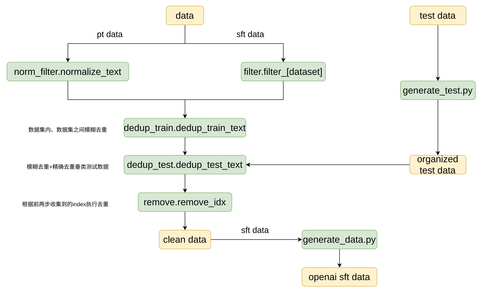

## 目录结构

```bash
data
├── data_requirements.txt——————进行数据处理所需要的环境
├── dedup_test.py——————————————数据集模糊去重+精确去重垂类测试数据，整理观测index				
├── dedup_train.py—————————————数据集内、数据集之间模糊去重，整理观测index	
├── filter.py——————————————————原始sft数据筛选
├── generate_data.py———————————去重后的sft数据转openai对话格式
├── generate_test.py———————————整理垂类测试数据
├── hashes.txt—————————————————精确去重垂类测试数据的中间结果
├── MAP.py—————————————————————数据集名称与filter.py中函数的映射
├── norm_filter.py—————————————pt数据NFC正则化，去掉较短的数据
├── preprocess.sh——————————————指令
├── pt_main.log————————————————pt数据处理日志
├── pt_main.py—————————————————pt数据处理流程
├── README.md
├── remove.py——————————————————根据需去重的观测index执行去重
├── sft_main.log———————————————sft数据处理日志
├── sft_main.py————————————————sft数据处理流程
└── utils.py———————————————————一些多次使用的函数
```

## 实现流程



## 运行

1. 整理垂直领域测试集

   下载opencompass评测集：

   ```bash
   wget https://github.com/open-compass/opencompass/releases/download/0.2.2.rc1/OpenCompassData-core-20240207.zip
   unzip OpenCompassData-core-20240207.zip
   ```

   ```bash
   cd data/
   # 修改generate_test.py的PREFIX变量为本地评测数据目录，整理垂类评测数据集，用于后续去重
   python generate_test.py
   ```

2. 修改`preprocess.sh`：

   ```bash
   python [prefix_path]/pt_main.py \
       --input_dir [data_prefix_path]/[dataset,eg.minpt]/ \
       --test_dir 同generate_test.py的PREFIX变量 \
       --nf_threshold 增量预训练不考虑简单清洗后长度低于nf_threshold的项
   
   python [prefix_path]/sft_main.py \
       --input_dir [data_prefix_path]/[dataset,eg.minsft]/ \
       --test_dir 同generate_test.py的PREFIX变量
   ```

3. 修改`pt_main.py`和`sft_main.py `的`ds_names`变量和`ds_cols`变量。其中，`sft_main.py `中的`ds_names`在`MAP.py`中对应了初步筛选数据的方法

4. 数据处理：

   ```bash
   bash preprocess.sh
   ```


## 参考

https://github.com/Cerebras/modelzoo/blob/Release_2.1.1/modelzoo/transformers/data_processing/slimpajama/
